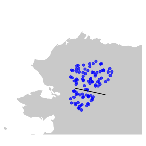

```{r, include = FALSE}
knitr::opts_chunk$set(
  collapse = TRUE,
  comment = "#>",
	echo = TRUE
)
```

### Load libraries  
```{r setup, results="hide",message=FALSE,warning=FALSE}
library(crossR)
library(sf)
library(ggplot2)
library(gganimate)
```

### Load sample input data   

#### Load seasonal ranges
```{r, results="hide",message=FALSE,warning=FALSE}
winter_22_23<-st_read(system.file("wah_range_list.gpkg",package="crossR"),layer="winter_22_23")
calving23<-st_read(system.file("wah_range_list.gpkg",package="crossR"),layer="calving23")
```

#### Load road start/end coordinates
```{r}
data(wah_rdcoords)
```

### Format inputs   
`range_list` is just a list of sf data frames representing each range simulated animals will move between, in consecutive order (the first range is where animals are initialized), with names of list representing names of the seasonal ranges.
```{r}
range_list=list("winter_22_23"=winter_22_23,"calving23"=calving23)
```

### Format inputs to run simulation
```{r, results="hide",message=FALSE,warning=FALSE}
spatial_input=Format_Spatial_Data(range_list,rdcoords,inc=1000)
```

### Set movement parameters
```{r}
mv_jday=
	Set_Spatial_Movement(
		n_range=2,
		sl_shp=c(10000,10000),
		sl_rat=c(0.8,0.8),
		start=c(1,100),
		end=c(99,199),
		sample_input=FALSE,
		sel_range_names=names(range_list)
		)
```

### Run simulation
```{r, results="hide",message=FALSE,warning=FALSE}
output_list=
	Range_Simulate(spatial_input, #spatial input formatted from Format_Spatial_Data
							 rdcoords, #road start/end coordinates in matrix
							 mv_jday, #data frame with behavioral strategy shift indicated by jday
							 jday_max=199, #maximum numeric day
							 N0=100,	#number of animals to simulate
							 inc=1000, #resolution of spatial grid of simulation in meters
							 dist_start=100000, #distance in meters where to initialize from centerpoint of first range
							 out.opts=c("tracking") #output options
							 )
```

### Visualize simulation output
```{r, results="hide",message=FALSE,warning=FALSE}
trackdf=
	Vizualize_Tracks(output_list$tracking,
								 path="track_viz.gif",
								 spatial_input,
								 country="United States of America",
								 plot_buffer=c(-250000,-100000,100000,120000))
```



